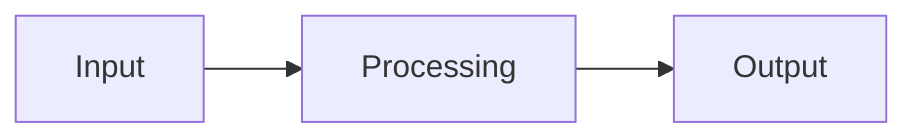

# Tobia Cavalli – Personal Website

This repository contains the source code for my personal website, built using
the [Hugo](https://gohugo.io/) static site generator and a modified version of
the [Bear Cub](https://github.com/clente/hugo-bearcub) theme.

You can find my website at 🔗
[https://tobiacavalli.com](https://tobiacavalli.com)

## Content structure

Posts live in `content/essays/` (long-form) and `content/guides/` (how-to). Each post is a **leaf bundle**: a directory containing `index.md` and any assets it uses.

```text
content/essays/my-post/
  index.md
  figure-1.png
```

Images placed in the bundle directory are automatically processed, resized, and converted to WebP at build time.

## Front matter

| Field | Description |
| --- | --- |
| `title` | Page title |
| `date` | Publication date (`YYYY-MM-DD`) |
| `lastmod` | Last modified date (`YYYY-MM-DD`); shown in post meta only when explicitly set |
| `summary` | Short description shown on list pages |
| `description` | Longer description used in SEO meta tags |
| `lead` | Introductory paragraph rendered below the title in lead style; supports Markdown |
| `tags` | Array of tags, e.g. `["materials-science", "history"]` |
| `toc` | `true` to show a collapsible table of contents (default: `true` for essays and guides) |
| `math` | `true` to enable KaTeX rendering on this page |
| `slug` | Custom URL slug, overrides the directory name |
| `aliases` | Array of redirect paths, e.g. `["/old/url/"]` |
| `draft` | `true` to exclude from production builds |

`author` and `hideReply` are set via cascade in the section `_index.md` files and do not need to be set per post.

## Math

Enable KaTeX on a page with `math: true` in front matter, then use standard LaTeX delimiters:

| Style | Syntax |
| --- | --- |
| Inline | `\(x^2 + y^2 = r^2\)` |
| Block (LaTeX) | `\[ E = mc^2 \]` |
| Block (dollar) | `$$ E = mc^2 $$` |

## Diagrams

No front matter needed. Use a fenced code block with the `mermaid` language tag:

````markdown

````

## Callouts

Callouts use GitHub-style blockquote alert syntax:

```markdown
> [!note]
> Text of the callout.
```

With a custom title:

```markdown
> [!warning] Watch out
> Something important to flag.
```

As a `<details>` element (add `+` after the type); starts expanded, can be collapsed:

```markdown
> [!note]+
> This starts expanded and can be collapsed by the reader.
```

Available types:

| Color | Types |
| --- | --- |
| Blue | `note`, `info`, `abstract`, `summary`, `tldr`, `todo` |
| Green | `tip`, `hint`, `important`, `success`, `check`, `done` |
| Orange | `warning`, `caution`, `attention` |
| Red | `danger`, `error`, `bug`, `failure`, `fail`, `missing` |
| Purple | `question`, `help`, `faq` |
| Teal | `example` |
| Gray | `quote`, `cite` |

## Tags

Add a `tags` array to any post's front matter:

```yaml
tags: ["materials-science", "history-of-science"]
```

Each tag generates an archive page at `/tags/<tag-name>/`.

## Bookshelf

The `/bookshelf` page lists books, papers, and essays organized by theme. Data is stored in `data/bookshelf/`, with one TOML file per theme. Files are rendered in alphabetical order, so numeric prefixes control display order.

### Adding a theme

Create a new file, e.g. `data/bookshelf/02_history_of_science.toml`:

```toml
name = "History of Science"

[[sections]]
type = "Books"

  [[sections.entries]]
  ...

[[sections]]
type = "Papers"

  [[sections.entries]]
  ...
```

The `name` field is the heading shown on the page. The `type` field inside each `[[sections]]` block can be `"Books"`, `"Papers"`, or `"Essays"`.

### Entry fields

| Field | Required | Applies to | Description |
| --- | --- | --- | --- |
| `title` | yes | all | Title of the work |
| `author` | yes | all | Author name(s) |
| `year` | yes | all | Publication year |
| `status` | yes | all | `"read"` or `"reading"` |
| `annotation` | no | all | Short personal note, shown in italics below the entry |
| `image` | no | Books | Cover image filename (see below) |
| `doi` | no | Papers, Essays | Bare DOI identifier, e.g. `10.1000/xyz123` — renders as a `doi ↗` link |

Only `"read"` and `"reading"` entries appear on the page. There is no want-to-read status.

### Book cover images

Cover images go in `assets/images/bookshelf/`. Hugo automatically resizes and converts them to WebP at build time — place the original file at any resolution. The suggested naming convention is `{lastname}_{short_title}.jpg`, e.g. `bush_pieces-of-the-action.jpg`. Reference the filename (not the path) in the `image` field. If the field is absent or the file is not found, no image is shown.

### Example

```toml
name = "Science and Engineering"

[[sections]]
type = "Books"

  [[sections.entries]]
  title = "Pieces of the Action"
  author = "Vannevar Bush"
  year = 1970
  status = "read"
  image = "bush_pieces-of-the-action.jpg"
  annotation = "A firsthand account of how American science was mobilized during World War II."

[[sections]]
type = "Papers"

  [[sections.entries]]
  title = "Science: The Endless Frontier"
  author = "Vannevar Bush"
  year = 1945
  status = "reading"
  doi = "10.2307/3224875"
  annotation = "The report that shaped postwar US science policy."
```

## Contributing

Currently, this repository is not intended for public contributions. However,
feel free to fork the repository and customize it for your own website.
