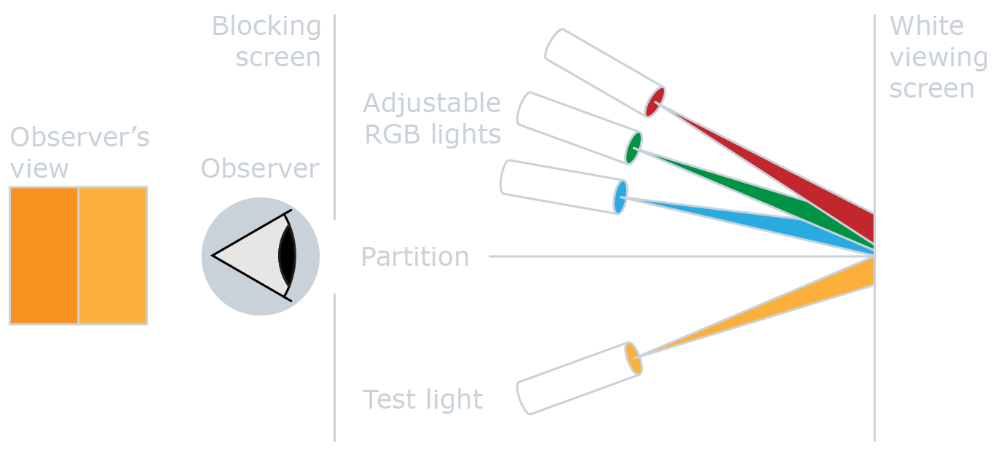
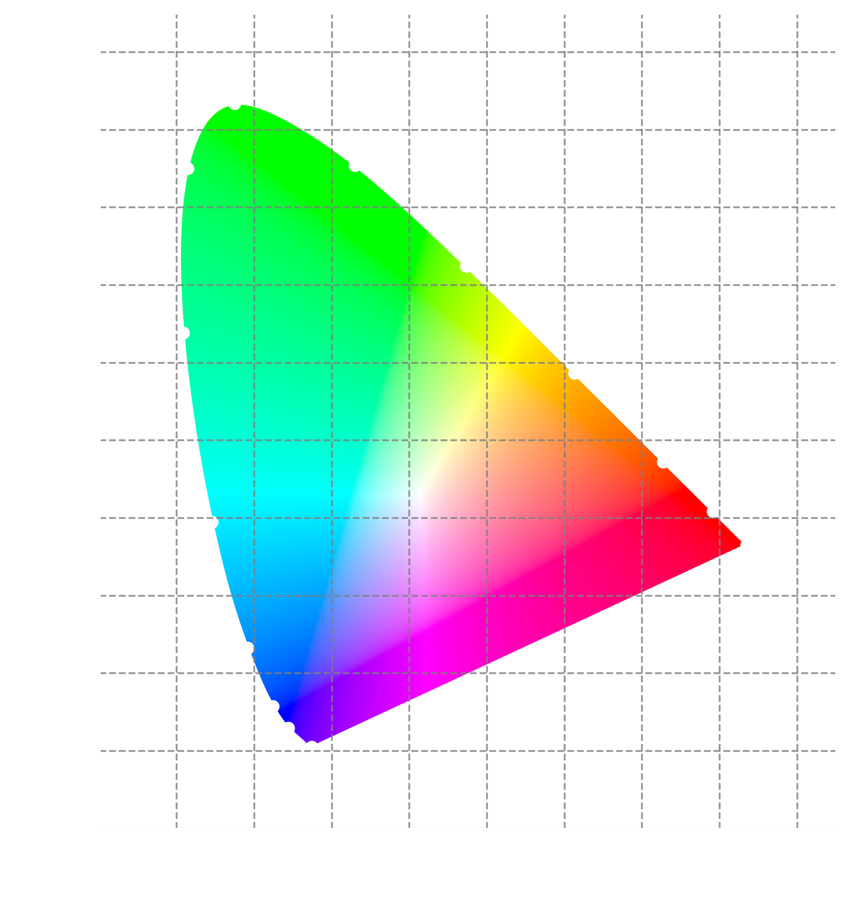
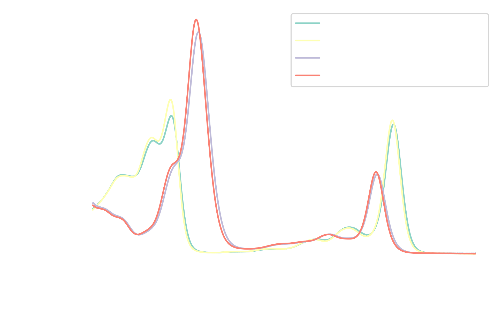
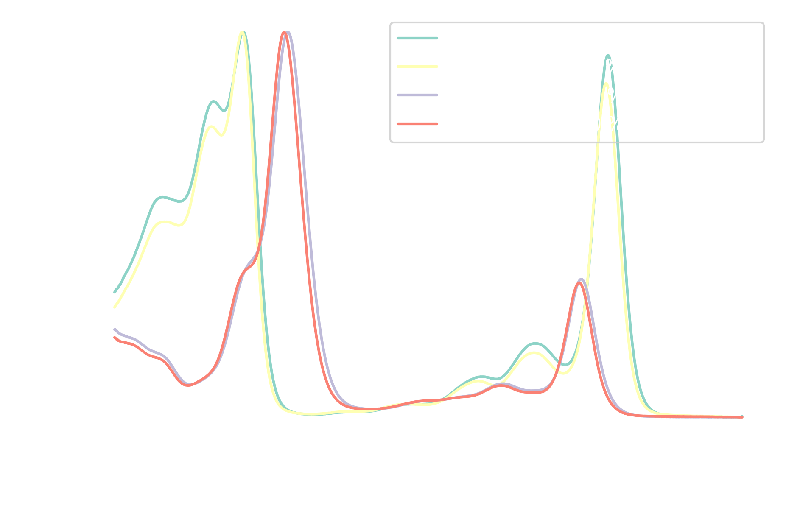
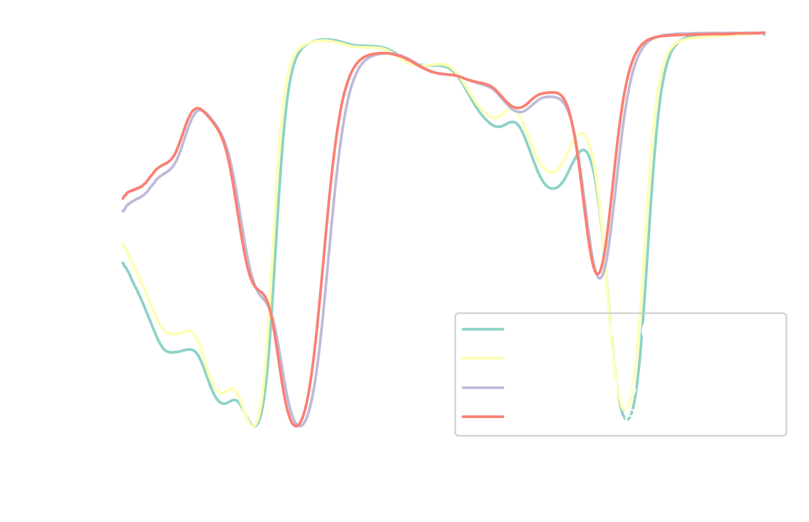
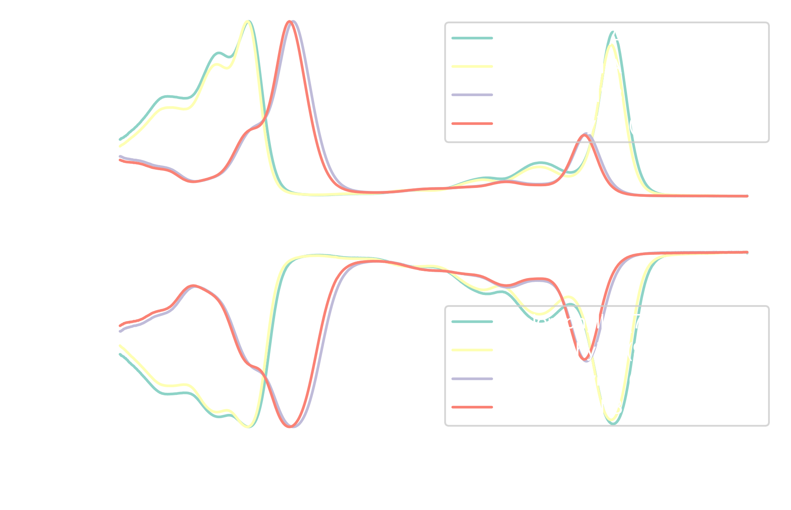
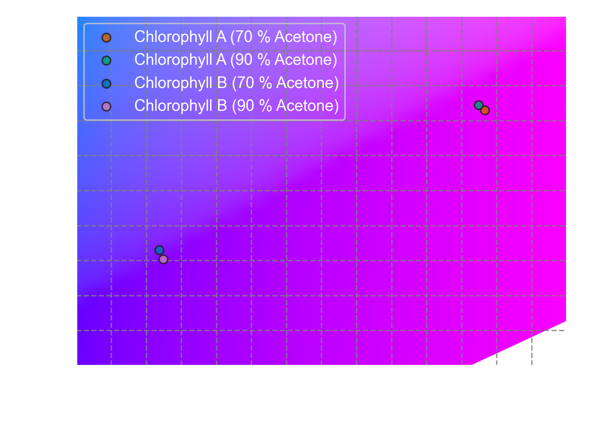
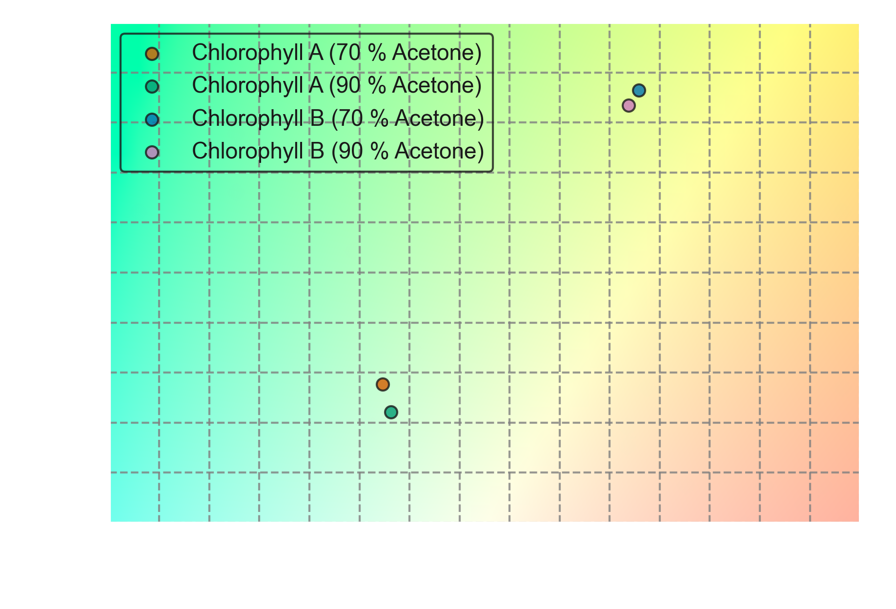

## Outline

- [1. What is color?](#1-what-is-color)
- [2. The CIE colorimetry system](#2-the-cie-colorimetry-system)
- [3. Python code](#3-python-code)
  - [3.1. Python libraries for color analysis](#31-python-libraries-for-color-analysis)
  - [3.2. Plot settings](#32-plot-settings)
  - [3.3. Plotting the CIE (2°) color space](#33-plotting-the-cie-2-color-space)
  - [3.4. Importing and scaling data](#34-importing-and-scaling-data)
  - [3.5. Converting absorbance to transmittance](#35-converting-absorbance-to-transmittance)
  - [3.6. Calculating the CIE colors](#36-calculating-the-cie-colors)
  - [3.7. Visualizing colors on the CIE color space](#37-visualizing-colors-on-the-cie-color-space)
- [4. Conclusion](#4-conclusion)
- [5. Bibliography](#5-bibliography)

> [!NOTE] Summary
> This post provides a step-by-step guide on how to calculate CIE colors from UV-Vis spectra using Python. We'll look at the CIE colorimetry system and the underlying principles behind color perception.
>
> The core of the post focuses on practical implementation, guiding you through the Python code that performs the necessary calculations. If you're primarily interested in the coding aspect, you can skip directly to the [Python code section](#3-python-code).

## 1. What is color?

Color isn't just a thing; it's a _feeling_. It's how our brains interpret light, and it's pretty subjective. Think about it: the same light can look different to different people, even under the same conditions. From a pure physical and biological point of view, it is a phenomenon arising from the human eye's interpretation of light within the visible spectrum (380--780 nm). It's not a physical property of light itself, but a sensation created by the brain's processing of visual information.

Factors like lighting conditions, color vision deficiencies, and individual variations can influence how we perceive color. This subjectivity makes traditional scientific measurements, like spectroscopy, insufficient for directly quantifying color perception, as they focus only on the physical properties of light without considering their corresponding perceptual aspects.

**Psychophysics** bridges this gap by quantifying the relationship between physical stimuli and the sensations they generate. As a field, it is primarily concerned with how humans perceive and interpret sensory inputs like colors, sounds, and textures. Guy Brindley's work in 1970 was a significant contribution to this field.<sup>1,2</sup>

Brindley introduced the concept of observations to describe perceptual states during psychophysical tasks. He categorized observations into two types:

1. **Class A observations:** When two physically different stimuli are perceived as identical. Despite their distinct physical properties, the observer cannot distinguish between them.
2. **Class B observations:** All other cases where stimuli are distinguishable.

Color is a prime example of Class A observations. Two lights with different physical compositions can appear identical under certain conditions. For instance, a pure red light and a mixture of red, green, and blue light can be perceived as the same shade of red if viewed in low light or by someone with limited color sensitivity.

## 2. The CIE colorimetry system

Given the subjectivity of color perception, how can we objectively measure and communicate colors? The **CIE colorimetry system** provides a solution by using **color matching** experiments to establish a statistical representation of human color vision, which provides a standardized method for relating spectral light distributions to perceived colors.

In these experiments, observers compare two stimuli under controlled conditions. If they appear identical despite their physical differences, they are considered perceptually equivalent. The CIE system, developed by the Commission Internationale d'Éclairage, quantifies the relationship between wavelength distributions and perceived colors.<sup>3,4</sup>



The CIE 1931 model, introduced in 1931, uses additive color mixing based on **Color Matching Functions (CMFs)**. These functions represent the spectral sensitivity of the three types of cone cells in the human eye, denoted as \(\bar{x}\), \(\bar{y}\), and \(\bar{z}\).

CMFs are derived from standardized experiments involving foveal vision, specific field sizes, dark surroundings, and average observations from multiple individuals, providing a statistical measure of color receptor sensitivity.

By convolution of the sample spectrum \(M(\lambda)\) with the CMFs, we calculate **tristimulus values** \(X\), \(Y\), and \(Z\). These values represent the amounts of the three primary colors (red, green, and blue) required to match the given color.

$$
\begin{align}
    X &= \int_{380}^{780} M(\lambda) \bar{x}(\lambda)  \, d\lambda \tag{1}\\
    Y &= \int_{380}^{780} M(\lambda) \bar{y}(\lambda)  \, d\lambda \tag{2}\\
    Z &= \int_{380}^{780} M(\lambda) \bar{z}(\lambda)  \, d\lambda \tag{3}
\end{align}
$$

The tristimulus values define a point in a three-dimensional color space. However, for practical purposes, this space is often reduced to two dimensions using the \(x\) and \(y\) chromaticity coordinates:

$$
\begin{align}
    x &= \frac{X}{X + Y + Z} \tag{4}\\
    y &= \frac{Y}{X + Y + Z} \tag{5}
\end{align}
$$

The \(x\) and \(y\) coordinates uniquely specify a color within the CIE color space, enabling a standardized and objective representation of color perception. This system has been (and is!) used in various industries, including printing, photography, lighting design, and digital media, where accurate color reproduction and communication are essential.

## 3. Python code

### 3.1. Python libraries for color analysis

Before diving into the code, let's import the necessary Python libraries:

- `numpy`: This library is used for numerical computing. It defines efficient data structures and mathematical functions for working with arrays and matrices.
- `pandas`: This library is used for data analysis and manipulation. It defines data structures like DataFrames and Series for handling tabular data.
- `matplotlib`: This library is a standard for data visualization. It includes plotting functions for creating various types of charts and graphs.
- `colour-science`: This library provides specific tools for colorimetric analysis. It supports most major color systems and includes many color space conversions utilities, color difference metrics, and other color-related operations. You can read the corresponding documentation at [https://colour.readthedocs.io](https://colour.readthedocs.io).

If you'd like to replicate this analysis on your machine, you can install these libraries using the following `pip` command in your terminal or PowerShell (assuming you don't have them installed already):

```sh
pip install numpy pandas matplotlib colour-science
```

With the libraries installed, we can now import them into our script or Jupyter notebook:

```python
import colour as cl
import matplotlib.pyplot as plt
import matplotlib.ticker as tck
import numpy as np
import pandas as pd

# Disable some annoying warnings from colour library
cl.utilities.filter_warnings(colour_usage_warnings=True)
```

### 3.2. Plot settings

I want the plot aesthetics to match the style of the blog, and therefore I'm adding the following settings to customize the appearance of the graphics I am going to generate. If you're following along on your own machine (e.g., using Jupyter notebooks), you can skip this step.

Here, I am importing `seaborn`, a powerful library for statistical data visualization. I won't be using its statistical functions, but I prefer its default presets over the ones provided by `matplotlib`. After importing the library, I am setting:

- `set_context("notebook")`: This setting ensures the plots are scaled appropriately for notebook environments, adjusting factors like label size and line thickness.
- `set_style("ticks")`: This sets the plot style to include ticks on the axes, providing visual reference points for the data.
- `set_palette("colorblind")`: Sets the default palette of colors that will be used for plots, selecting a color palette specifically designed for viewers with color blindness. The `color_codes` option remaps `matplotlib`'s shorthand color codes (such as `r`, `g`, `b`, etc.).

In addition, I am importing `golden_ratio` from the `scipy` library, which is equivalent to defining a variable containing the value 1.618. This is a mathematical constant also known as the _divine proportion_, which I will use to set the aspect ratio of the plots, specifically the ratio between the shorter and longer axes. It is absolutely not necessary, but I find that it helps create a more aesthetically pleasing visual balance.

```python {linenostart=9}
import seaborn as sns
from scipy.constants import golden_ratio

# Set seaborn defaults
sns.set_context("notebook")
sns.set_style("ticks")
sns.set_palette("colorblind", color_codes=True)

# Use white color for elements that are typically black
plt.style.use("dark_background")

# Remove background from figures and axes
plt.rcParams["figure.facecolor"] = "none"
plt.rcParams["axes.facecolor"] = "none"

# Default figure size to use throughout
figure_size = (7, 7 / golden_ratio)
```

### 3.3. Plotting the CIE (2°) color space

Now that we have our tools in place, let's create our first color plot. One thing that I like very much about the `colour-science` library is that it provides handy functions for plotting color spaces according to different colorimetric systems.

We're going to use the `plot_chromaticity_diagram_CIE1931` function to show the CIE color space for a 2° observer. This is like a map of all the colors humans can see within a small area of the eye. The CIE color space is a triangle where the corners represent pure red, green, and blue. Any color can be plotted somewhere inside this triangle by mixing different amounts of these primary colors.

By plotting this color space, we can get a better feel for the colors we can perceive and compare different colors to see how similar or different they are. We'll use it later to analyze colors and create a color model.

```python {hl_lines=["5-11"],linenostart=26}
# Instantiate figure and axes
fig, ax = plt.subplots(1, 1, figsize=(7, 7))

# Plot CIE color space for a 2°
cl.plotting.plot_chromaticity_diagram_CIE1931(
    cmfs="CIE 1931 2 Degree Standard Observer",
    axes=ax,
    show=False,
    title=None,
    spectral_locus_colours="white",
)

# Axes labels
ax.set_xlabel("x (2°)")
ax.set_ylabel("y (2°)")

# Axes limits
ax.set_xlim(-0.1, 0.85)
ax.set_ylim(-0.1, 0.95)

# Ticks separation
ax.xaxis.set_major_locator(tck.MultipleLocator(0.1))
ax.xaxis.set_minor_locator(tck.MultipleLocator(0.01))
ax.yaxis.set_major_locator(tck.MultipleLocator(0.1))
ax.yaxis.set_minor_locator(tck.MultipleLocator(0.01))

# Grid settings
ax.grid(which="major", axis="both", linestyle="--", color="gray", alpha=0.8)

# Padding adjustment
plt.tight_layout()

plt.show()
```



### 3.4. Importing and scaling data

Let's see if we can calculate the actual color of some interesting molecules! In this example, we'll determine the colors of Chlorophyll A and Chlorophyll B in solution, two pigments essential for photosynthesis in plants. The data used here consists of pre-recorded UV-Vis spectra for Chlorophyll A and B in both 70% and 90% acetone solutions, obtained from a scientific publication.<sup>6</sup> You can download the `.csv` file containing this data [here](include/chlorophyll_uv_vis.csv).

```python {linenostart=59}
column_names = ["lambda", "chl_a_70", "chl_a_90", "chl_b_70", "chl_b_90"]
measured_samples = pd.read_csv(
    "chlorophyll_uv_vis.csv", names=column_names, header=0, index_col="lambda"
)
measured_samples
```

|            | **chl_a_70** | **chl_a_90** | **chl_b_70** | **chl_b_90** |
|------------|--------------|--------------|--------------|--------------|
| **lambda** |              |              |              |              |
| 350.0      | 26132.0      | 25552.0      | 29529.0      | 28301.0      |
| 350.4      | 26251.0      | 25804.0      | 29574.0      | 28114.0      |
| 350.8      | 26666.0      | 26083.0      | 29350.0      | 27946.0      |
| 351.2      | 26703.0      | 26227.0      | 29084.0      | 27660.0      |
| 351.6      | 26834.0      | 26473.0      | 28991.0      | 27632.0      |
| ...        | ...          | ...          | ...          | ...          |
| 748.4      | -63.0        | -269.0       | -15.0        | -159.0       |
| 748.8      | -80.0        | -289.0       | -2.0         | -141.0       |
| 749.2      | -95.0        | -283.0       | -13.0        | -157.0       |
| 749.6      | -92.0        | -292.0       | -2.0         | -150.0       |
| 750.0      | 82.0         | -198.0       | 69.0         | -172.0       |

_1001 rows × 4 columns_

The imported data represents the absorbance (\(A\)) of each chlorophyll type, which is measured at regular intervals of light (lambda). In simpler terms, absorbance indicates the amount of light absorbed by a specific molecule at a particular wavelength. Let's take a quick look at these spectra:

```python {hl_lines=["12-15"],linenostart=60}
fig, ax = plt.subplots(1, 1, figsize=figure_size)

# Define the labels for the plot's legend
chl_labels = [
    "Chlorophyll A (70 % Acetone)",
    "Chlorophyll A (90 % Acetone)",
    "Chlorophyll B (70 % Acetone)",
    "Chlorophyll B (90 % Acetone)",
]

# Iterate over dataframe and plot each spectrum
for col, sample_label in zip(measured_samples.columns, chl_labels):
    ax.plot(measured_samples.index,
            measured_samples[col],
            label=sample_label)

# Ticks separation
ax.xaxis.set_major_locator(tck.MultipleLocator(50))
ax.xaxis.set_minor_locator(tck.MultipleLocator(10))

# Axes labels
ax.set_xlabel("Wavelength [nm]")
ax.set_ylabel("Absorbance [a.u.]")

# Display legend
ax.legend()

plt.show()
```



From this initial inspection, we can see that Chlorophyll A absorbs light primarily in the blue and red regions of the spectrum, corresponding to the peaks at around 430 nm and 670 nm. Chlorophyll B also absorbs light in the blue and red regions, with peaks near 460 nm and 650 nm, but its absorption peak in the blue region is slightly shifted towards the green compared to chlorophyll A.

Additionally, the concentration of acetone in the solution seems to influence the peak intensities. While the overall spectral shapes remain consistent for each chlorophyll type, the intensity variations likely affect their perceived colors.

The current spectra also have significantly different absolute absorbance values. Therefore, some data pre-processing is required before calculating color. To enable meaningful comparisons, we need to normalize the data. This normalization will change the original absorbance values, which might be a disadvantage for _quantitative_ analyses (e.g., concentration determination). However, since our focus here is _qualitative_ (comparing spectra), these intensity scale differences would not provide an effective comparison.

The simplest approach for this is to normalize the spectra, transforming them into a range between 0 and 1 while preserving their overall shapes. We'll use a technique called range scaling (also known as MinMax scaling), described by the following equation:<sup>7</sup>

$$
    x_{scaled} = \frac{x - x_{min}}{x_{max} - x_{min}} \tag{6}
$$

Here, \(x\) represents a single measured value, \(x_{min}\)​ and \(x_{max}\)​ represent the minimum and maximum values within the spectrum, respectively, and \(x_{scaled}\) represents the resulting normalized value.

While the `scikit-learn` library offers built-in functions for this task (see [here](https://scikit-learn.org/stable/modules/generated/sklearn.preprocessing.MinMaxScaler.html)), I prefer to avoid introducing unnecessary dependencies for a simple function. Therefore, we'll define a custom function named `normalize` to perform the MinMax scaling:

```python {linenostart=86}
def normalize(x: pd.Series | np.ndarray) -> pd.Series | np.ndarray:
    """MinMax scaling from 0 to 1

    Args:
        x (pd.Series | np.ndarray): series or array to normalize

    Returns:
        pd.Series | np.ndarray: series or array of normalized values
    """
    x_scaled = (x - x.min()) / (x.max() - x.min())
    return x_scaled
```

This function takes a pandas Series or NumPy array (`x`) as input and performs the MinMax scaling operation. It subtracts the minimum value (`x.min()`) from each element in `x` and then divides the result by the difference between the maximum (`x.max()`) and minimum values. This ensures all values in the output (`x_scaled`) fall within the range of 0 to 1.

Now, we can leverage vectorization to efficiently apply the `normalize` function to the entire DataFrame containing the absorbance values. This will create a new DataFrame with the normalized values, stored in the variable `abs_norm`:

```python {linenostart=97}
abs_norm = normalize(measured_samples)
abs_norm
```

|            | **chl_a_70** | **chl_a_90** | **chl_b_70** | **chl_b_90** |
|------------|--------------|--------------|--------------|--------------|
| **lambda** |              |              |              |              |
| 350.0      | 0.324398     | 0.285405     | 0.227556     | 0.207087     |
| 350.4      | 0.325869     | 0.288188     | 0.227903     | 0.205727     |
| 350.8      | 0.331001     | 0.291269     | 0.226179     | 0.204505     |
| 351.2      | 0.331458     | 0.292859     | 0.224133     | 0.202425     |
| 351.6      | 0.333078     | 0.295576     | 0.223417     | 0.202221     |
| ...        | ...          | ...          | ...          | ...          |
| 748.4      | 0.000507     | 0.000254     | 0.000262     | 0.000095     |
| 748.8      | 0.000297     | 0.000033     | 0.000362     | 0.000225     |
| 749.2      | 0.000111     | 0.000099     | 0.000277     | 0.000109     |
| 749.6      | 0.000148     | 0.000000     | 0.000362     | 0.000160     |
| 750.0      | 0.002300     | 0.001038     | 0.000908     | 0.000000     |

_1001 rows × 4 columns_

The resulting DataFrame (`abs_norm`) now has absorbance values between 0 and 1, which can be verified by plotting them:

```python {linenostart=99}
fig, ax = plt.subplots(1, 1, figsize=figure_size)

for col, sample_label in zip(abs_norm.columns, chl_labels):
    ax.plot(abs_norm.index,
            normalize(abs_norm[col]),
            label=f"{sample_label} norm")

# Ticks separation
ax.xaxis.set_major_locator(tck.MultipleLocator(50))
ax.xaxis.set_minor_locator(tck.MultipleLocator(10))
ax.yaxis.set_major_locator(tck.MultipleLocator(0.1))
ax.yaxis.set_minor_locator(tck.MultipleLocator(0.025))

# Axes labels
ax.set_xlabel("Wavelength [nm]")
ax.set_ylabel("Absorbance [a.u.]")

# Display legend
ax.legend()

plt.show()
```



### 3.5. Converting absorbance to transmittance

Before calculating the colors from our spectra, it's important to remember that these spectra represent the **light absorbed** by the molecules. To determine the color we actually perceive, we need to convert absorbance to **transmittance**. Transmittance represents the light that passes through the molecules and reaches our eyes.

The conversion from absorbance (\(A\)) to transmittance (\(T\)) is straightforward and follows this equation:

$$
    T = 10^{(2 - A)} \tag{7}
$$

Using the normalized absorbance values, we can easily perform this conversion by defining the `abs_to_trans` function:

```python {linenostart=120}
def abs_to_trans(A: pd.Series | np.ndarray) -> pd.Series | np.ndarray:
    """Convert absorbance to transmittance

    Args:
        A (pd.Series | np.ndarray): series or array of absorbance values

    Returns:
        pd.Series | np.ndarray: series or array of transmittance values
    """
    T = 10 ** (2 - A)
    return T
```

This function takes a Series or array of absorbance values as input and returns a Series or array of corresponding transmittance values.

Now, we can apply this function to the entire `abs_norm` DataFrame to efficiently calculate the transmittance for each spectrum. This will create a new DataFrame (`transm_norm`) containing the normalized transmittance values for each chlorophyll sample.

```python {linenostart=131}
transm_norm = abs_to_trans(abs_norm)
transm_norm
```

|            | **chl_a_70** | **chl_a_90** | **chl_b_70** | **chl_b_90** |
|------------|--------------|--------------|--------------|--------------|
| **lambda** |              |              |              |              |
| 350.0      | 47.380775    | 51.831637    | 59.216627    | 62.074481    |
| 350.4      | 47.220520    | 51.500565    | 59.169440    | 62.269182    |
| 350.8      | 46.665880    | 51.136488    | 59.404698    | 62.444622    |
| 351.2      | 46.616747    | 50.949585    | 59.685281    | 62.744426    |
| 351.6      | 46.443207    | 50.631871    | 59.783692    | 62.773854    |
| ...        | ...          | ...          | ...          | ...          |
| 748.4      | 99.883339    | 99.941532    | 99.939788    | 99.978231    |
| 748.8      | 99.931694    | 99.992372    | 99.916775    | 99.948098    |
| 749.2      | 99.974380    | 99.977117    | 99.936247    | 99.974883    |
| 749.6      | 99.965841    | 100.000000   | 99.916775    | 99.963164    |
| 750.0      | 99.471847    | 99.761259    | 99.791184    | 100.000000   |

_1001 rows × 4 columns_

Let's verify that the conversion to transmittance worked as expected by plotting the new values:

```python {hl_lines=["3-4"],linenostart=133}
fig, ax = plt.subplots(1, 1, figsize=figure_size)

for col, sample_label in zip(transm_norm.columns, chl_labels):
    ax.plot(transm_norm.index, transm_norm[col], label=f"{sample_label}")

# Ticks separation
ax.xaxis.set_major_locator(tck.MultipleLocator(50))
ax.xaxis.set_minor_locator(tck.MultipleLocator(10))
ax.yaxis.set_major_locator(tck.MultipleLocator(10))
ax.yaxis.set_minor_locator(tck.MultipleLocator(5))

# Axes labels
ax.set_xlabel("Wavelength [nm]")
ax.set_ylabel("Transmittance [%]")

# Display legend
ax.legend()

plt.show()
```



As expected, the normalized transmittance values range between 0 and 1 (or 0% and 100% transmittance). We can see the inverse relationship between absorbance and transmittance: higher absorbance corresponds to lower transmittance, and vice versa. For a more direct comparison, we can visualize both absorbance and transmittance in a single plot.

```python {hl_lines=["4-5", "8-9"],linenostart=152}
fig, ax = plt.subplots(2, 1, sharex=True, figsize=figure_size)

# Iterate over absorbance dataframe
for col, sample_label in zip(abs_norm.columns, chl_labels):
    ax[0].plot(abs_norm.index, normalize(abs_norm[col]), label=f"{sample_label}")

# Iterate over transmittance dataframe
for col, sample_label in zip(transm_norm.columns, chl_labels):
    ax[1].plot(transm_norm.index, transm_norm[col], label=f"{sample_label}")

# Axes labels
ax[0].set_ylabel("Absorbance [a.u.]")

ax[1].set_xlabel("Wavelength [nm]")
ax[1].set_ylabel("Transmittance [%]")

# Ticks separation
for axis in ax:
    axis.xaxis.set_major_locator(tck.MultipleLocator(50))
    axis.xaxis.set_minor_locator(tck.MultipleLocator(10))
    # Display legend
    axis.legend()

ax[0].yaxis.set_major_locator(tck.MultipleLocator(0.1))
ax[0].yaxis.set_minor_locator(tck.MultipleLocator(0.025))
ax[1].yaxis.set_major_locator(tck.MultipleLocator(10))
ax[1].yaxis.set_minor_locator(tck.MultipleLocator(5))

plt.show()
```



### 3.6. Calculating the CIE colors

Now that we have the normalized absorbance and transmittance spectra, we can finally calculate the corresponding CIE colors. To do this, we need to do the following:

- **Select the color matching functions:** We'll use the CIE 1931 system, specified as `cie_2_1931` in `colour-science`.
- **Select the appropriate illuminant:** Since we're interested in daylight conditions, we'll use the `D65` illuminant.
- **Create spectral distributions:** For each spectrum, we'll create a `SpectralDistribution` object from `colour-science`. This provides useful methods like `interpolate`, which is necessary to ensure the spectra conform to CIE specifications (1 nm intervals).
- **Calculate CIE \(XYZ\) coordinates:** Using the `sd_to_XYZ` function, we'll compute the CIE XYZ coordinates for each spectrum based on the spectral distribution, color matching functions, and illuminant.
- Convert to CIE \(xy\) coordinates: The \(XYZ\) coordinates are then converted to CIE \(xy\) coordinates, which are more convenient for plotting on the color space.

This code iterates over each spectrum, calculates the CIE \(XYZ\) coordinates, converts them to \(xy\) coordinates, and stores the results in two lists: `chl_abs_clr` for the absorbance-based colors and `chl_transm_clr` for the transmittance-based colors. Finally, the results are merged into a single DataFrame for easier analysis.

```python {linenostart=181}
# Define color matching functions
cmfs = cl.MSDS_CMFS["cie_2_1931"]

# Define illuminant
illuminant = cl.SDS_ILLUMINANTS["D65"]

chl_abs_clr = []

# Iterate over each normalized absorbance spectrum
for col in abs_norm.columns:
    # Initialize spectral distribution
    sd = cl.SpectralDistribution(data=abs_norm[col])

    # Interpolate sd to conform to the CIE specifications
    sd = sd.interpolate(cl.SpectralShape(350, 750, 1))

    # Calculate CIE XYZ coordinates from spectral distribution
    cie_XYZ = cl.sd_to_XYZ(sd, cmfs, illuminant)

    # Convert to CIE xy coordinates
    cie_xy = cl.XYZ_to_xy(cie_XYZ)

    # Append the results to the list of sample colors
    chl_abs_clr.append(
        {"sample": col, "x_A": np.round(cie_xy[0], 4), "y_A": np.round(cie_xy[1], 4)}
    )

chl_transm_clr = []

# Iterate over each normalized transmittance spectrum
for col in transm_norm.columns:
    # Initialize spectral distribution
    sd = cl.SpectralDistribution(data=transm_norm[col])
    sd = sd.interpolate(cl.SpectralShape(350, 750, 1))

    # Calculate CIE XYZ coordinates from spectral distribution
    cie_XYZ = cl.sd_to_XYZ(sd, cmfs, illuminant)

    # Convert to CIE xy coordinates
    cie_xy = cl.XYZ_to_xy(cie_XYZ)

    # Append the results to the list of sample colors
    chl_transm_clr.append(
        {"sample": col, "x_T": np.round(cie_xy[0], 4), "y_T": np.round(cie_xy[1], 4)}
    )

# Convert dictionaries to dataframes and join them together
colors = pd.merge(pd.DataFrame(chl_transm_clr), pd.DataFrame(chl_abs_clr))
colors
```

|      | **sample** | **x_T** | **y_T** | **x_A** | **y_A** |
|------|------------|---------|---------|---------|---------|
| 0    | chl_a_70   | 0.3046  | 0.3777  | 0.2966  | 0.1330  |
| 1    | chl_a_90   | 0.3063  | 0.3721  | 0.2948  | 0.1345  |
| 2    | chl_b_70   | 0.3558  | 0.4365  | 0.2036  | 0.0930  |
| 3    | chl_b_90   | 0.3538  | 0.4334  | 0.2048  | 0.0904  |

### 3.7. Visualizing colors on the CIE color space

Now that we have the \(x\) and \(y\) values for both absorbed and transmitted colors, let's plot them on the CIE 1931 color space. This code first plots the CIE color space as we have seen [at the beginning](#33-plotting-the-cie-2-color-space). Then, it iterates through the `colors` DataFrame and plots the absorbed colors (based on the `x_A` and `y_A` columns) as scattered points on the color space with corresponding labels, colors, and edge colors.

```python {linenostart=230}
# Instantiate figure and axes
fig, ax = plt.subplots(1, 1, figsize=figure_size)

# Plot CIE color space for a 2°
cl.plotting.plot_chromaticity_diagram_CIE1931(
    cmfs="CIE 1931 2 Degree Standard Observer",
    axes=ax,
    show=False,
    title=None,
    spectral_locus_colours="white",
)

color_list = ["r", "g", "b", "m"]

for i, c in enumerate(color_list):
    ax.scatter(
        colors["x_A"][i],
        colors["y_A"][i],
        label=chl_labels[i],
        color=c,
        edgecolors="k",
        alpha=0.8,
    )

# Axes labels
ax.set_xlabel("x (2°)")
ax.set_ylabel("y (2°)")

# Axes limits
ax.set_xlim(0.18, 0.32)
ax.set_ylim(0.06, 0.16)

# Ticks separation
ax.xaxis.set_major_locator(tck.MultipleLocator(0.01))
ax.xaxis.set_minor_locator(tck.MultipleLocator(0.005))
ax.yaxis.set_major_locator(tck.MultipleLocator(0.01))
ax.yaxis.set_minor_locator(tck.MultipleLocator(0.005))

# Grid settings
ax.grid(which="major", axis="both", linestyle="--", color="gray", alpha=0.8)

# Display legend
ax.legend()

# Adjust plot padding
plt.tight_layout()

plt.show()
```



To visualize the transmitted colors, we can reuse most of the existing code and simply modify the data source:

```python {linenostart=278}
# Instantiate figure and axes
fig, ax = plt.subplots(1, 1, figsize=figure_size)

# Plot CIE color space for a 2°
cl.plotting.plot_chromaticity_diagram_CIE1931(
    cmfs="CIE 1931 2 Degree Standard Observer",
    axes=ax,
    show=False,
    title=None,
    spectral_locus_colours="white",
)

color_list = ["r", "g", "b", "m"]

for i, c in enumerate(color_list):
    ax.scatter(
        colors["x_T"][i],
        colors["y_T"][i],
        label=chl_labels[i],
        color=c,
        edgecolors="k",
        alpha=0.8,
    )

# Axes labels
ax.set_xlabel("x (2°)")
ax.set_ylabel("y (2°)")

# Axes limits
ax.set_xlim(0.25, 0.4)
ax.set_ylim(0.35, 0.45)

# Ticks separation
ax.xaxis.set_major_locator(tck.MultipleLocator(0.01))
ax.xaxis.set_minor_locator(tck.MultipleLocator(0.005))
ax.yaxis.set_major_locator(tck.MultipleLocator(0.01))
ax.yaxis.set_minor_locator(tck.MultipleLocator(0.005))

# Grid settings
ax.grid(which="major", axis="both", linestyle="--", color="gray", alpha=0.8)

# Display legend
ax.legend(labelcolor="k", edgecolor="k")

# Adjust plot padding
plt.tight_layout()

plt.show()
```



From the CIE color space plots, we can observe some key differences between the perceived colors of Chlorophyll A and B under both absorbance and transmittance conditions. Chlorophyll A primarily absorbs light in the red and blue regions of the spectrum, reflecting green-yellow light. Chlorophyll B absorbs a greater proportion of blue light than Chlorophyll A, reflecting a more yellowish hue.

## 4. Conclusion

While both chlorophyll A and B are primarily responsible for the green color of plants, their slight differences in absorption spectra can lead to subtle variations in the exact shade of green. Despite being closely related pigments, they show distinct spectral absorption profiles, which ultimately influence their perceived colors.

Since both chlorophyll A and B absorb light in the blue and red regions, the light that is transmitted is primarily in the green region, which is why leaves appear green to our eyes. However, due to the slight difference in absorption peaks, Chlorophyll A tends to give a more deep green or olive green color, while Chlorophyll B gives a slightly lighter green or yellowish-green hue.

## 5. Bibliography

(1) Kingdom, F. A. A.; Prins, N. _Psychophysics: A Practical Introduction_, 2nd ed.; Academic Press: Amsterdam, NL, 2016; pp. 19--20. [https://doi.org/10.1016/C2012-0-01278-1](https://doi.org/10.1016/C2012-0-01278-1).

(2) Schanda, J. _Colorimetry: Understanding the CIE System_; John Wiley & Sons: Hoboken, NJ, USA, 2007; pp. 56--59. [https://doi.org/10.1002/9780470175637](https://doi.org/10.1002/9780470175637).

(3) Guild, J. The Colorimetric Properties of the Spectrum. _Phil. Trans. R. Soc. Lond. A_ **1931**, _230_ (681-693), 149--187. [https://doi.org/10.1098/rsta.1932.0005](https://doi.org/10.1098/rsta.1932.0005).

(4) Smith, T.; Guild, J. The C.I.E. Colorimetric Standards and Their Use. _Trans. Opt. Soc._ **1931**, _33_ (3), 73--134. [https://doi.org/10.1088/1475-4878/33/3/301](https://doi.org/10.1088/1475-4878/33/3/301).

(5) Fairman, H. S.; Brill, M. H.; Hemmendinger, H. How the Cie 1931 Color-Matching Functions Were Derived from Wright-Guild Data. _Color Res. Appl._ **1997**, _22_ (1), 11--23. [https://doi.org/10.1002/(SICI)1520-6378(199702)22:1\<11::AID-COL4\>3.0.CO;2-7](https://doi.org/10.1002/(SICI)1520-6378(199702)22:1<11::AID-COL4>3.0.CO;2-7).

(6) Chazaux, M.; Schiphorst, C.; Lazzari, G.; Caffarri, S. Precise Estimation of Chlorophyll a , b and Carotenoid Content by Deconvolution of the Absorption Spectrum and New Simultaneous Equations for Chl Determination. _Plant J._ **2022**, _109_ (6), 1630--1648. [https://doi.org/10.1111/tpj.15643](https://doi.org/10.1111/tpj.15643).

(7) Otto, M. _Chemometrics: Statistics and Computer Application in Analytical Chemistry_, 4th ed.; Wiley-VCH Verlag: Weinheim, DE, 2024; pp. 137--140. [https://doi.org/10.1002/9783527843800](https://doi.org/10.1002/9783527843800).
