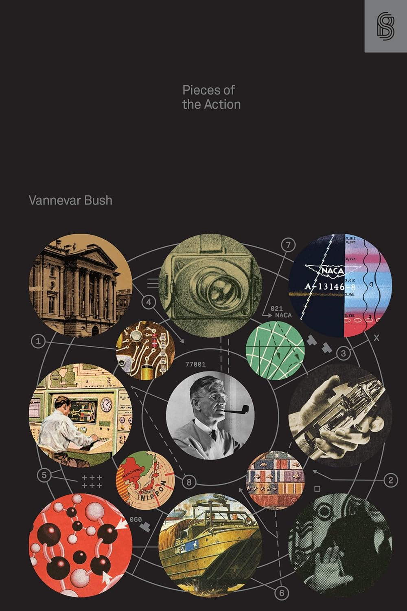

## The Book In Synthesis

What if you were tasked with leading the development of technology that could
decide the fate of World War II?

Managing such an effort would require balancing not just logistics but also the
complex dynamics of human leadership. Vannevar Bush, one of the key figures
behind the U.S. wartime science efforts, faced exactly this challenge. His
book, "Pieces of the Action," is a direct account about how he navigated scarce
resources, complex supply chains, and the immense pressure to succeed.

This book is a unique recollection and analysis of how these monumental efforts
were managed, straight from the man who orchestrated them.

## Managing R&D Means Managing The Unpredictable

What makes research and development (R&D) so challenging to manage is not just
the science, but the inherent unpredictability.[^1]

R&D isn't a straightforward process of following steps to reach a goal. In
fact, the goal itself might be unknown until much later in the journey.

R&D involves a range of activities, from identifying valuable problems to
developing practical solutions. Each step is full of uncertainty---new insights
can reshape the project's direction, or unanticipated failures can derail
progress. Unlike tasks where outcomes are more predictable, R&D depends heavily
on creativity and adaptability. You can't map out every detail in advance
because experimentation is at the heart of the process. This makes managing R&D
especially difficult, as leaders must embrace ambiguity while guiding teams
toward tangible results.

This uncertainty is also what makes R&D uniquely valuable. The breakthroughs
that emerge from this chaotic process can lead to revolutionary technologies or
products. But to get there, teams must be comfortable with frequent deviations
from the original plan. Leaders who understand this can create an environment
where innovation thrives despite the inevitable setbacks.

In the end, effective R&D management is less about control and more about
nurturing flexibility and creativity.

## Successful R&D Is The Result Of Culture And Methodology

R&D is a key driver of an organization's long-term success. In fact, some of
the world's most successful companies, like Amazon, Alphabet, Meta, Apple, and
Microsoft, spent over $200 billion on R&D in 2022 alone. This massive
investment is a crucial part of their strategy to stay ahead of the competition
in a fast-evolving tech landscape.

But R&D is more than just a financial commitment; it requires strategic focus.
Throwing money at research without clear guiding principles can quickly become
an exercise in futility. Effective R&D requires a thoughtful balance of
exploration and discipline, where the search for new ideas is directed by
well-defined objectives. The challenge is knowing what to prioritize---what
works and what doesn't---amid the uncertainty. It's also crucial to pass this
knowledge to others, creating a culture where teams know how to develop ideas
and translate them into real, valuable outcomes.

This is why companies that excel in R&D are not just pouring resources into
innovation but building frameworks for success. They focus on training their
people to recognize meaningful problems, approach them methodically, and
iterate toward solutions. Without these principles, the most well-funded R&D
efforts could easily go off course or stagnate.

Ultimately, successful R&D isn't just about money---it's about having a system
that transforms investment into innovation.

## R&D Is Closely Tied to Its Context

Every R&D project is a unique challenge with countless variables at play.

For each problem or idea, there are potentially infinite choices, approaches,
and solutions. What works for one project might not work for another, given the
vast differences in context.[^2]

R&D is highly contextual, which means that success is never guaranteed by a
one-size-fits-all formula. While traditional constraints like time, cost, and
scope---the "iron triangle"---are essential, they are just the starting point.
Additional factors such as team culture, conflicting stakeholder interests, and
the chosen development approach can make or break a project. How the project is
tracked, how it transitions from development to production, and how deployment
is handled are equally important. Each of these elements introduces complexity
that can drastically change how an R&D project unfolds and ultimately
succeeds.[^3]

This variability means that project managers need to be adaptable, adjusting
strategies based on the unique circumstances of each R&D effort. Teams that
thrive in R&D know how to assess and prioritize these factors, allowing them to
navigate the inherent uncertainty. The more agile and responsive the team, the
better they are equipped to steer projects toward successful outcomes.

In R&D, success depends on understanding the context and fine-tuning the
approach to match the project's unique challenges.

## World War II As A Large Scale Case Study

R&D isn't the only field that deals with complex, context-dependent problems.

Many disciplines have developed approaches to better understand and navigate
these kinds of challenges. One of the most influential methods is the case
study approach, widely used in fields like law and social sciences.

The case study method, initially developed by Christopher Columbus Langdell in
the legal field, is a powerful tool for analyzing context-dependent
problems.[^4] [^5] By examining real-world situations in their natural context,
this approach allows us to explore the nuanced factors that influence outcomes.
In the world of R&D, particularly during large-scale efforts like those in
wartime, this approach can offer deep insights into what makes such projects
successful. Vannevar Bush's *Pieces of the Action* is, in essence, a case study
of one of the largest coordinated R&D efforts in history: the U.S. application
of science and technology during World War II. As head of the Office of
Scientific Research and Development (OSRD), Bush was central in overseeing the
scientific advancements that contributed to the Allied victory. His account
provides not only a historical narrative but also a framework for understanding
the principles that made this immense R&D effort a success.

Bush's leadership at the OSRD shows the importance of coordination and strategy
in large-scale R&D. His insights reflect how wartime R&D was a complex,
multifaceted challenge that required balancing scientific innovation with
logistical constraints. The lessons he shares through his case study resonate
beyond their historical context, and are still precious for modern leaders in
science, technology, and management.

In this way, *Pieces of the Action* serves as both a historical record and a
case study in effective R&D management under extraordinary conditions.

## Should You Read It?

Many of the most important innovations of the 20th century were born out of the
R&D efforts during World War II.

From penicillin to jet engines, these breakthroughs weren't just technical
feats; they were the result of coordinated, large-scale R&D efforts between the
U.S. and the U.K. Vannevar Bush was at the center of these projects, ensuring
their success from idea to deployment.

Bush's *Pieces of the Action* provides a behind-the-scenes look at how these
innovations---such as the proximity fuse, radar, and guided missiles---came to
life during WWII. As both a skilled engineer and an experienced administrator,
Bush offers a unique perspective into the technical processes and the
managerial strategies required to drive such projects forward. His perspective
goes beyond technical expertise---he emphasizes the importance of managing
teams, navigating organizational structures, and balancing freedom with
oversight. Bush's understanding of human psychology plays a critical role in
his leadership style, which allowed him to ensure that scientists and
technicians had the freedom to innovate while also aligning their efforts with
the overarching goals of the war effort. As proof of this, an entire chapter of
the book is dedicated to identifying and removing disruptive elements, or
*tyros*, individuals who could derail progress through arrogance or ignorance
of established structures.

What makes Bush's book particularly valuable is its dual focus on both
technical innovation and the often-overlooked managerial skills that drive
successful R&D. He touches on everything from the politics of committees to the
psychology of teams, offering timeless lessons for managing large-scale,
complex projects. These insights are not just historical---they remain deeply
relevant for anyone involved in leading or organizing innovation today.

Through *Pieces of the Action*, Bush teaches us that successful R&D requires
both technical expertise and a deep understanding of the human factors that
drive project success. Should you read it? Absolutely yes.

[^1]: Wingate, L. M. *Project Management for Research and Development: Guiding
    Innovation for Positive R&D Outcomes*; Levin, G., Series Ed.; Best
    Practices and Advances in Program Management; CRC Press: Boca Raton, FL,
    USA, 2015.
[^2]: Some would say it is a *wicked problem*. For more on this, see: Senge, P.
    M. *The Fifth Discipline: The Art and Practice of the Learning
    Organization*, 2nd ed.; Doubleday/Currency: New York, NY, USA, 2006.
[^3]: *The Standard for Project Management and a Guide to the Project
    Management Body of Knowledge (PMBOK Guide)*, 7th ed.; Project Management
    Institute, Inc.: Newtown Square, PA, USA, 2017.
[^4]: *The Case Study Teaching Method*.
    [https://casestudies.law.harvard.edu/the-case-study-teaching-method/](https://casestudies.law.harvard.edu/the-case-study-teaching-method/)
    (accessed 2024-08-26).
[^5]: Crowe, S.; Cresswell, K.; Robertson, A.; Huby, G.; Avery, A.; Sheikh, A.
    The Case Study Approach. *BMC Med. Res. Methodol.* **2011**, *11* (1), 100.
    [https://doi.org/10.1186/1471-2288-11-100](https://doi.org/10.1186/1471-2288-11-100).
