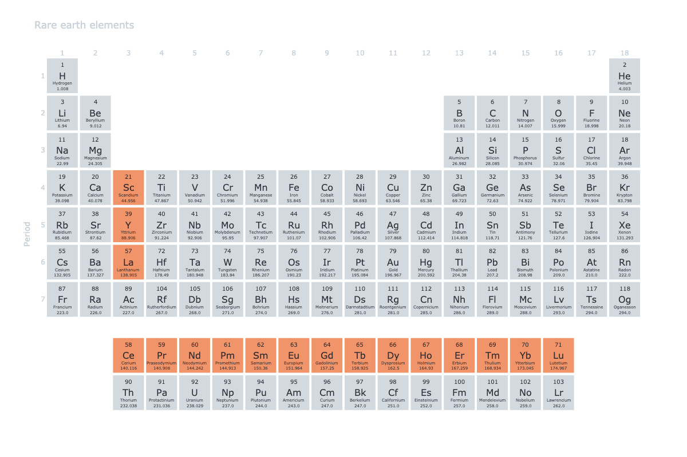

Rare earth elements are central to modern technology: smartphones, electric
vehicles, and wind turbines all depend on them. Finnish chemist Johan Gadolin
identified the first of them, yttrium, in 1794. Their importance became clear
only in the mid-20th century, more than 150 years later.[^1]

The family consists of scandium, yttrium, and the 15 lanthanides, which sit
between barium and hafnium on the periodic table. Identifying the remaining 16
would take more than a century after Gadolin's work.[^2] [^3]

At the time, chemists were identifying new elements at a rapid pace. Rare
earths were the most difficult to characterize. Extracted from minerals like
yttria and ceria, they did not fit any of the patterns chemists had developed
for other elements.

## Neither rare nor earths

The name "rare earths" reflects the assumptions of the chemists who first
encountered these substances, not what we now know about them. When chemists
first isolated them in the late 1700s, they obtained them as oxides, which
were then called "earths" (from the French _terre_ and German _Erde_).[^4]
The minerals containing them, yttria and ceria, were known only from a single
location, the village of Ytterby in Sweden, and their apparent scarcity there
gave the family the other half of its name.[^5] [^6]

Rare earths are not actually rare. They are more abundant in Earth's crust
than mercury or cadmium. The difficulty is that they occur in trace
concentrations across many minerals rather than in concentrated deposits, like
a thousand euros in cents scattered across a beach instead of a single
ten-euro bill in your pocket.

The real difficulty was not scarcity but chemical similarity. The 15
lanthanides have nearly identical electron configurations, which makes
separating them like sorting a mix of dark blue and navy blue marbles by
color. Specialized techniques are needed to tell them apart.

This chemical similarity also explains why yttria and ceria are not unique
sources. The same elements were later found in monazite, a mineral that would
become the main industrial source for rare earths. What seemed at first to be
a Swedish curiosity is a family of elements distributed throughout Earth's
crust.

## First discoveries

Chemistry advanced rapidly in the late 18th and early 19th centuries. Boyle,
Lavoisier, and Dalton established that the elements are the simplest
substances, those that cannot be broken down further by chemical means. By
the mid-19th century, nearly 70 of the 90 naturally occurring elements had
been identified.[^4]

The rare earths were the exception to this rapid progress. The two minerals
containing them, yttria and ceria, had been identified by 1787, but the
elements within them could not be reliably separated for more than 160 years,
and the last of them, promethium, was not isolated until 1947. Even Dmitri
Mendeleev and Julius Lothar Meyer, who built the first periodic tables in the
1860s, could not fit them into their classification. The puzzle was only
resolved by the development of atomic theory in the 20th century, which
showed why the lanthanides in particular have nearly identical chemical
properties.

### Yttria

In 1787, Carl Axel Arrhenius, a Swedish army officer and amateur geologist,
collected an unusual black mineral near the village of Ytterby and called it
simply "black stone."[^7] Swedish chemist Bengt Reinhold Geijer published the
first report on it in 1788, but the decisive analysis came in 1794, when
Finnish chemist Johan Gadolin found that nearly 38% of the stone consisted of
an unknown "earth" (now known to be an oxide), along with iron and silicate.

In 1795, Swedish chemist Anders Ekeberg confirmed Gadolin's findings and named
the oxide "yttria" after Ytterby. Like most chemists at the time, Ekeberg
treated the new "earth" as an element in its own right, a misconception that
persisted until 1808, when Humphry Davy's electrolysis experiments showed that
yttria was a compound. The metallic element within it would later be isolated
and named yttrium.

The black stone continued to yield results. In 1802, Ekeberg identified yttria
in another mineral, yttrotantalite, and from it isolated tantalum. German
chemist Martin Heinrich Klaproth and French chemist Louis Nicolas Vauquelin
independently confirmed Gadolin's analysis. Klaproth then named the original
mineral "gadolinite" in his honor.

### Ceria

A second Swedish mineral, cerite, had been suspected of containing an unknown
"earth" since the mid-1700s, but confirming it took decades. In 1803, two
independent teams reported the result almost simultaneously. The Swedish
chemists Jöns Jacob Berzelius and Wilhelm Hisinger were one, and the German
chemist Martin Heinrich Klaproth, who had earlier confirmed Gadolin's work on
yttria, was the other. Both teams published their findings in the _Neues
Allgemeines Journal der Chemie_ in the same year.

A naming dispute followed. Klaproth proposed "ochroite earth," while
Berzelius and Hisinger proposed "ceria," after the dwarf planet Ceres, which
had been discovered two years earlier. Ceria won, largely due to Hisinger's standing as
an industrialist and patron of science, though most of the analytical work had
likely been done by the young Berzelius.

The two teams interpreted the result differently. Klaproth treated the new
"earth" as an element in its own right, the same misconception that had
attached to yttria. Berzelius correctly identified it as the oxide of a new
element, an interpretation consistent with the work that would later make him
one of the founders of modern chemistry: precise atomic mass calculations, the
formalization of atomic theory, and the modern system of chemical symbols.
Klaproth, already known for the discovery of uranium and zirconium, continued
his work on strontium, titanium, and tellurium.

The yttria and ceria discoveries set a pattern that would repeat throughout
the 19th century: the rare earths rarely came alone, and characterizing them
required collaboration across national boundaries.

## Mosander's investigation

It took two decades for chemists to realize that the original "earths" were
not pure elements but metal oxides. Ceria became cerium oxide, yttria became
yttrium oxide. The reclassification was straightforward, but the trouble
began with the atomic masses.

Measurements of the atomic masses of these supposedly pure elements varied
between samples, which had no good explanation if the elements really were
pure. The most plausible interpretation was that they were mixtures.

Carl Gustaf Mosander, assistant to Jöns Jacob Berzelius, took up the problem
in the 1820s and worked on it for the next two decades. He began with cerium,
subjecting it to a long series of reactions. In one experiment he heated
cerium oxide with sodium and chlorine to obtain metallic cerium, and he
noticed that cerium compounds varied in color and density depending on their
mineral source. He concluded that cerium oxide must contain at least one
additional element. His colleague Friedrich Wöhler urged him to publish, but
Mosander refused to commit to a result until he was certain of it, a caution
that frustrated his colleagues but was essential to the discoveries that
followed.

## Two earths become six

In 1839, after years of work, Mosander confirmed that cerium oxide was not a
single substance. He isolated a new element from it and named it lanthanum,
from the Greek for "to escape notice."[^8] Two years later, in 1841, he
identified a third element in cerium oxide and named it didymium, from the
Greek for "twin," because its chemistry resembled that of lanthanum. Wöhler
and Berzelius found the name unusual, but the result stood. Didymium would
itself turn out to be a mixture in the 1880s, when it was resolved into
praseodymium and neodymium.

Mosander's analytical methods were as important as the elements he isolated.
He developed techniques for repeated crystallization and gravimetric analysis
that required extreme care, and in 1843 Berzelius documented them in detail,
showing how Mosander had separated cerium, lanthanum, and didymium from what
had appeared to be a single substance.

Mosander then applied the same methods to yttrium oxide, working from
gadolinite. In 1843 he isolated two more elements, erbium and terbium, with
yttrium as the remaining fraction. He used oxalate precipitation to separate
them, exploiting differences in reactivity and in the color and crystal form
of the precipitates. What had begun as two "earths," cerium and yttrium, was
now six elements, and the rare earths were not what chemists had first taken
them to be.

## Spectral analysis

Mosander's separation methods were slow. A single result could require months
or years of repeated crystallizations and precise measurements, and as
organic chemistry advanced through the middle of the 19th century, work on
the rare earths slowed.

In 1859, Robert Bunsen and Gustav Kirchhoff introduced spectral analysis.
Heated elements emit light at characteristic wavelengths, and the resulting
pattern of spectral lines is unique to each element. Identification could now
be made directly from the spectrum, without the long sequence of separation
steps that Mosander had relied on.

The technique arrived just as Dmitri Mendeleev and Julius Lothar Meyer were
independently developing the periodic table in the late 1860s. Their table
organized the elements by atomic weight and chemical properties, exposing
relationships between them and even predicting the existence of elements that
had not yet been found.

The two tools were complementary. The periodic table identified gaps where
new elements should exist, and spectral analysis allowed chemists to look
for them directly. The slow crystallization work of Mosander's generation
gave way to a faster mode of discovery.

## A new generation

Spectral analysis and the periodic table brought a new generation of chemists
to the rare earths. Swiss chemist Jean Charles Galissard de Marignac built on
Mosander's methods to recalculate the atomic weights of cerium, lanthanum,
and didymium with much greater precision. His measurements arrived shortly
after the 1860 Karlsruhe Congress, where the need for standardized atomic
weights had been the central question, and they helped European chemists
converge on consistent values.

Another Swiss chemist, Marc Delafontaine, worked on Mosander's discoveries,
in particular terbium. Several chemists had worked on isolating it, which
makes the discovery hard to attribute to a single individual, but
Delafontaine's systematic studies clarified its properties. He then turned to
didymium, the "twin" element Mosander had identified, and noticed subtle
differences in its spectral lines that suggested it was not a single element.

The French chemist Paul Émile Lecoq de Boisbaudran later confirmed this.
Working with samarskite, a mineral rich in rare earths, he used spectral
analysis to show that didymium was a mixture. It would eventually be resolved
into praseodymium and neodymium. The pattern set by Mosander's lanthanum and
his original didymium repeated itself: an element that had been treated as
single turned out to be several.

## The final discoveries

In 1885, Austrian chemist Carl Auer von Welsbach succeeded where others had
failed and separated didymium into two elements. One gave green oxides, which
he named praseodidymium ("green twin"), and the other gave pink oxides, which
he named neodidymium ("new twin"). They are now known as praseodymium and
neodymium.

Von Welsbach pursued the practical applications as well as the chemistry. His
incandescent gas mantle, which used rare-earth salts, mainly thorium and
cerium, to produce bright light from a gas flame, was the basis of the
lighting company Osram and made him commercially successful. It is one of the
earliest cases of rare-earth research moving directly into industrial use.

In 1896, Eugène-Anatole Demarçay identified europium in samarium samples and
named it after Europe. At the end of the 19th century, von Welsbach and the
French chemist Georges Urbain independently showed that ytterbium contained
two elements. The names they proposed (Urbain's neoytterbium and lutetium,
von Welsbach's aldebaranium and cassiopeium) gave rise to a dispute that
lasted for decades. In Germany, "cassiopeium" remained in use in place of
lutetium until the Second World War.

Element 61 was the last gap. It was filled in 1947, when scientists at the
Manhattan Project isolated traces of it from uranium fission products and
named it promethium, after the Titan who brought fire to humanity. Promethium
is highly radioactive and occurs in nature only in trace amounts.

With promethium, the family was complete. What had begun in the 1780s with
two unidentified "earths" had become a chemical family of 17 elements. The
history of their discovery is less a story of breakthroughs than of patient,
generational work: a small number of chemists, working in close communication
across national borders, slowly resolved a chemistry that had no good
analytical handle until the 20th century gave them one.

[^1]: Critical Metals Handbook, 1st ed.; Gunn, G., Ed.; John Wiley & Sons,
    2013.
    [https://doi.org/10.1002/9781118755341](https://doi.org/10.1002/9781118755341).
[^2]: Höppe, H. Rare-Earth Elements: Solid State Materials: Chemical, Optical
    and Magnetic Properties; De Gruyter Graduate; De Gruyter: Berlin, DE, 2024.
    [https://doi.org/10.1515/9783110680829](https://doi.org/10.1515/9783110680829).
[^3]: Voncken, J. H. L. The Rare Earth Elements; SpringerBriefs in Earth
    Sciences; Springer: Cham, CH, 2016.
    [https://doi.org/10.1007/978-3-319-26809-5](https://doi.org/10.1007/978-3-319-26809-5).
[^4]: Gschneidner, K. A.; Eyring, L. _Handbook on the Physics and Chemistry of
    Rare Earths: Two-Hundred-Year Impact of Rare Earths on Science_; Handbook
    on the Physics and Chemistry of Rare Earths; Elsevier Science: Amsterdam,
    NL, 1988; Vol. 11.
[^5]: Rowlatt, J. Rare Earths: Neither Rare, nor Earths. _BBC News_. March 23,
    2014.
    [https://www.bbc.com/news/magazine-26687605](https://www.bbc.com/news/magazine-26687605)
    (accessed 2024-08-18).
[^6]: Klinger, J. M. A Historical Geography of Rare Earth Elements: From
    Discovery to the Atomic Age. _Extr. Ind. Soc._ **2015**, _2_ (3), 572–580.
    [https://doi.org/10.1016/j.exis.2015.05.006](https://doi.org/10.1016/j.exis.2015.05.006).
[^7]: Not to be confused with Svante Arrhenius, the Swedish Nobel Prize winner
    who was born in 1859.
[^8]: _Episodes from the History of the Rare Earth Elements_; Evans, C. H.,
    Ed.; Springer Netherlands: Dordrecht, NL, 1996.
    [https://doi.org/10.1007/978-94-009-0287-9](https://doi.org/10.1007/978-94-009-0287-9).
