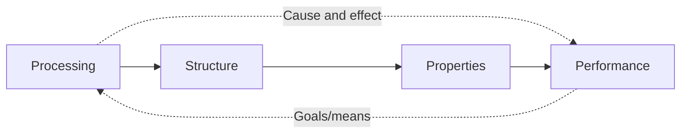

")

Every few years, international political tensions disrupt the global supply of
rare earths, and every time this results in a scramble to find more ore or to
build refineries faster.[^1] China controls around 70% of rare-earth
processing, but even if you solved that bottleneck tomorrow, you would still
have a problem: rare earths are not interchangeable commodities.

Neodymium, for example, is central in permanent magnets, which drive wind
turbines and electric motors. The problem is that this element cannot be
swapped with a different element, because that would force you to redesign the
corresponding alloy. A different alloy needs different processing. Different
processing produces a different structure, different magnetic properties, and
different performance in the final device. One substitution, and the whole
application doesn't work anymore. Why?

The cascade from composition through processing through structure to
performance is not specific to magnets. All materials work this way. We tend to
think of a material as a property on a datasheet, but it is really a web of
cause-and-effect relationships that goes from atoms to applications. There is a
framework that maps these relationships as a system:
**process-structure-properties-performance**, or **PSPP**. The rest of this
post is about what this framework looks like and where it comes from.

## What is a material?

Before exploring how systems thinking enters materials science, I think it
helps to be precise about what a material is. However, when I turned to
standard textbooks looking for a definition, I couldn’t find one.[^2] [^3] They
classify materials, describe their properties, discuss their history, but never
say what the word actually means.

So I searched further for a working definition of "material", and to my
surprise, I found that defining the term is not at all straightforward.[^4]
[^5] [^6] As I understand the problem, three factors make this harder than I
initially assumed:

1. The word "material" is treated as a primitive --- a word everyone
   understands well enough that it doesn't need a formal definition.
2. The field is interdisciplinary, and no single discipline has felt the need
   to own the definition.
3. There is no clear boundary between a "chemical" and a "material." The
   distinction depends on length scale, but where do you draw the line? Is a
   single molecule of polyethylene a material? What about a monolayer or a
   colloidal suspension?[^7]

Eventually I found two definitions that I could work with. In *Materials
Chemistry*, Fahlman defines a material as:[^8]

> [!note] Definition
> Any solid-state substance or device that may be used to address a current or
future societal need.

*Nature Materials* gives a similar definition, but with a broader scope:[^9]

> [!note] Definition
> \[...\] substances in the condensed states (liquid, solid, colloidal) designed
or manipulated for technological ends.

These definitions, together with the broader discussion cited earlier, point to
three features that seem to be common to all materials:

1. They are condensed-state substances.
2. Their properties emerge from the interactions, assembly, and defect
   structure of their constituent subunits.
3. They are created or designed for a specific purpose.

In other words, a material is not raw matter sitting in the ground: **it is
matter that someone has processed with an end in mind**. The definition itself
encodes a relationship between processing, structure, and purpose, and this
entanglement is not just a matter of semantics, because the concept cannot be
reduced to a single property or a single scale. If the definition is this
entangled, perhaps the right answer is not a sharper definition but a better
framework to think about materials.

## Three questions and a chain

The study of materials is often divided into three disciplines: **materials
science**, **materials engineering**, and **materials design**. However, this
division is cleaner on paper than in practice. A more useful way to think about
them is as three questions, each building on the last.

The first question is **why.** Why does this material behave the way it does?
This is materials science, which investigates the relationships between a
material's structure and its properties. A materials scientist synthesizes a
new material and asks what gives it its characteristics.

The second question is **how.** How do we make a material behave the way we
want? This is materials engineering: designing or manipulating the structure to
produce a predetermined set of properties. Where the scientist asks why
something works, the engineer asks how to produce it and make it work
differently.

The third question is **which.** Which material and which process satisfy a
specific need? The answer takes different forms depending on the starting
point:

- Materials **discovery** screens all possibilities.
- Materials **design** explores a specific region of the design space, often
  adding new materials or properties to it.
- Materials **selection** picks the best candidate from a space that is already
  known.

All three sit close to the application and depend on the answers to the other
two questions.

A material's properties depend on the spatial organization of its constituents
at every hierarchical level, from atomic arrangement up to macroscopic form.
But structure is not static. At any moment, a material carries structural
features that have not yet reached thermodynamic equilibrium. These features
reflect not only what it is made of, but how it was made and what it has
endured in service. Processing stays with the material long after it is
produced.

This causal chain --- processing determines structure, structure determines
properties, properties determine performance --- is the central paradigm of
materials science and engineering, and it is known as
**process-structure-properties-performance (PSPP)**.[^10] [^11] The diagram
below shows how it works:

Materials science typically works the chain from left to right: you start with
a process and ask what properties come out. This is the forward problem. You
pick apart individual links and examine them in isolation, like how does this
heat treatment change the grain size, and how does grain size affect hardness?
Each link gets its own experiments, its own models.

Materials design goes the other way. You start with what you need the material
to do and work backward: what properties would deliver that performance, what
structures would produce those properties, and what processing would create
those structures? This is the inverse problem, and it only becomes tractable if
you can hold the full chain in view at once.

## Materials as systems

So far, PSPP looks like a causal chain where one thing leads to the next. But
that picture is too simple. PSPP treats a material as a **system**, and that
word carries specific meaning.

A system is an arrangement of **elements**, **interconnections**, and a
**function** that work together to fulfill a **purpose**.[^12] The elements can
be tangible (atoms, grains, phases) or abstract (a model, a design constraint).
The interconnections define how elements influence each other. The function is
what the system is designed (or has evolved) to do.

A system's behavior over time is tracked through **stocks** and **flows**. A
stock is a measurable quantity that accumulates. Flows are the rates at which a
stock changes: inflows add to it, outflows subtract. When inflows and outflows
balance, the system reaches dynamic equilibrium. In a material, structure is
the central stock. Every processing step --- every heat treatment, every
deformation pass, every hour in service --- is a flow that deposits or removes
structural features. The microstructure you observe at any moment is the
cumulative record of everything the material has experienced.

Consistent behavior patterns in a system arise from **feedback loops**:
circular relationships where the system's output influences its own behavior.
Materials are full of them. Grain growth during annealing slows as grains
coarsen, because larger grains have less boundary energy driving further
growth. Crack propagation accelerates as a crack lengthens, because the stress
concentration at the tip increases with crack size. These loops (some
stabilizing, some reinforcing) are what give materials their characteristic
responses to time and environment.

What makes a system more than the sum of its parts is **emergence**: the
interactions between components produce behaviors that no single component
exhibits alone. A pile of iron atoms is not steel. The arrangement matters, and
the properties that result from that arrangement cannot be deduced by studying
iron and carbon in isolation.

A material is a hierarchically organized system composed of subsystems, each
operating at a different length scale. At the atomic scale: bonding and crystal
structure. At the microstructural scale: grain size, phase distribution, and
defect populations. At the macroscopic scale: geometry, surface condition, and
manufacturing history. Each level has its own characteristic structures and its
own models, but none is self-contained, and changes at one scale propagate up
and down the hierarchy.

## From Smith to systems engineering

The idea that materials behave as systems did not arrive all at once. In his
cornerstone article on materials design, Olson traces the origins of this idea
to the metallurgist and historian of science Cyril Stanley Smith, who was among
the first to describe materials as hierarchical systems.[^13] Clarence Zener
extended Smith's picture by adding the path dimension: processing history. In
any real material, some structural features have not had time to equilibrate.
The system is never at rest, and it carries the memory of how it was made.

Morris Cohen then introduced the principle of **reciprocity** between structure
and properties: properties can be rationalized in terms of structure, but
structure can equally be rationalized in terms of the properties it produces.
If the structure--property link runs both ways, then tools built to explain can
also be turned around to design.

What was still missing was a way to integrate these insights into something
operational. That came from systems engineering. The first step is analysis to
identify the problem and decompose it into component subsystems and their
interactions. This step is followed by synthesis: develop models for each
subsystem, integrate them to generate candidate solutions, build prototypes,
and test. Feedback from testing drives iterative redesign until the objectives
are met. Applied to materials, each scale becomes a subsystem with its own
models, its own experiments, and its own interface to the scales above and
below.

## Reading the chain backward

For most of its history, materials development advanced through testing
compositions, adjusting processes, and accumulating know-how. Serendipity
played a significant role in this process, and still does.[^14] [^15] If we
wanted a better magnet, we made magnets and tested them until something worked.

But if the links between processing, structure, properties, and performance are
causal in both directions, then the chain can be read backward. Start with a
need. Translate it into performance requirements, then into target properties,
then into the structures that would produce them, and finally into the
processing routes that would create those structures.

This changes what the rare-earth problem actually is. Without PSPP, a supply
disruption is a procurement problem: find more ore, build more refineries,
secure the chain. With PSPP, it is a design problem: identify which scales are
coupled to the element you are losing, which feedback loops constrain
substitution, and which processing routes are available for candidate
replacements. Those are different questions, and they lead to different
responses and different timescales.

The practical tools for carrying out this inversion --- computational modeling,
materials informatics, integrated computational materials engineering --- are
subjects for future posts. What matters here is the shift in how we ask the
question.

[^1]: Tewari, S. China controls the rare earths the world buys - can Trump’s new deals change that? BBC News. [https://www.bbc.com/news/articles/cj6ny24j0r3o](https://www.bbc.com/news/articles/cj6ny24j0r3o) (accessed 2026-03-28).
[^2]: Callister, W. D.; Rethwisch, D. G. *Materials Science and Engineering: An Introduction*, 10th ed.; Wiley: Hoboken, 2020.
[^3]: Ashby, M. F.; Shercliff, H.; Cebon, D. *Materials: Engineering, Science, Processing and Design*, 4th ed.; Butterworth-Heinemann: Oxford, UK, 2019.
[^4]: Moss, S. What Is a Material? *MRS Bull.* **2012**, *37* (1), 95–96. [https://doi.org/10.1557/mrs.2011.353](https://doi.org/10.1557/mrs.2011.353).
[^5]: Day, P.; Interrante, L.; West, A. Chemistry International -- Newsmagazine for IUPAC. *Chemistry International*. IUPAC 2009. [https://publications.iupac.org/ci/2009/3103/1_day.html](https://publications.iupac.org/ci/2009/3103/1_day.html) (accessed 2026-03-26).
[^6]: Marschallek, B. E.; Jacobsen, T. Classification of Material Substances: Introducing a Standards-Based Approach. *Mater. Des.* **2020**, *193*, 108784. [https://doi.org/10.1016/j.matdes.2020.108784](https://doi.org/10.1016/j.matdes.2020.108784).
[^7]: Defining scientific concepts is a difficult task. Chang's *Inventing Temperature* (Oxford University Press, 2004) is a great account of the difficulty of defining the scientific concept of "temperature". See [https://doi.org/10.1093/0195171276.001.0001](https://doi.org/10.1093/0195171276.001.0001).
[^8]: Fahlman, B. D. *Materials Chemistry*; Springer International Publishing: Cham, 2023. [https://doi.org/10.1007/978-3-031-18784-1](https://doi.org/10.1007/978-3-031-18784-1).
[^9]: Aims & Scope | Nature Materials. Nature Materials. [https://www.nature.com/nmat/aims](https://www.nature.com/nmat/aims) (accessed 2026-03-28).
[^10]: Olson, G. B. Computational Design of Hierarchically Structured Materials. *Science* **1997**, *277* (5330), 1237–1242. [https://doi.org/10.1126/science.277.5330.1237](https://doi.org/10.1126/science.277.5330.1237).
[^11]: Agrawal, A.; Choudhary, A. Perspective: Materials Informatics and Big Data: Realization of the "Fourth Paradigm" of Science in Materials Science. *APL Mater.* **2016**, *4* (5), 053208. [https://doi.org/10.1063/1.4946894](https://doi.org/10.1063/1.4946894).
[^12]: D. H. Meadows and D. Wright, *Thinking in systems: A Primer*, Chelsea Green Publishing, White River Junction, VT, 2015.
[^13]: Olson, G. B. Designing a New Material World. *Science* **2000**, *288* (5468), 993–998. [https://doi.org/10.1126/science.288.5468.993](https://doi.org/10.1126/science.288.5468.993).
[^14]: Fink, T. M. A.; Reeves, M.; Palma, R.; Farr, R. S. Serendipity and Strategy in Rapid Innovation. *Nat. Commun.* **2017**, *8* (1), 2002. [https://doi.org/10.1038/s41467-017-02042-w](https://doi.org/10.1038/s41467-017-02042-w).
[^15]: McDowell, D. L.; Kalidindi, S. R. The Materials Innovation Ecosystem: A Key Enabler for the Materials Genome Initiative. *MRS Bull.* **2016**, *41* (4), 326–337. [https://doi.org/10.1557/mrs.2016.61](https://doi.org/10.1557/mrs.2016.61).
